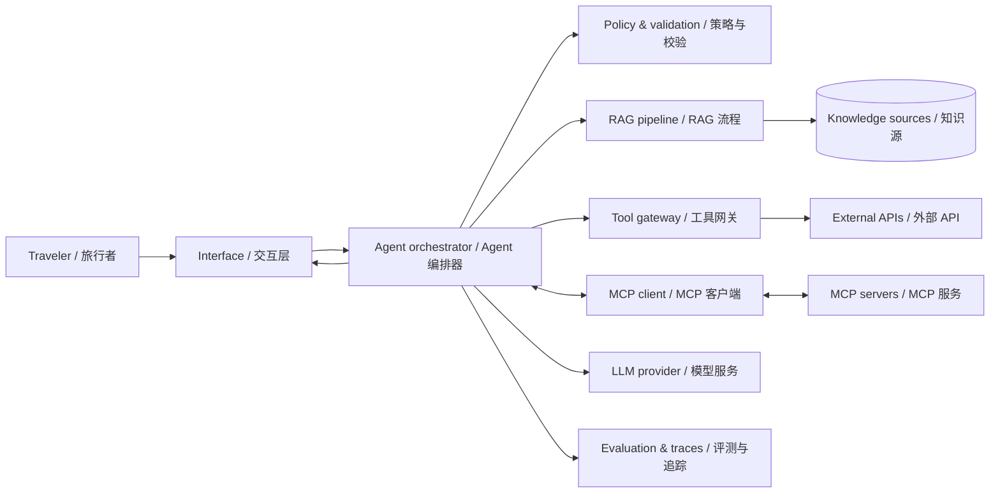

# Architecture notes / 架构说明

## Status / 状态

This is a target learning architecture, not an implementation contract. Technology and provider choices remain open and should be recorded as ADRs.

这是用于学习的目标架构，不是实现合同。技术栈与服务商尚未确定，关键选择应通过 ADR 记录。

## Principles / 原则

- **Ground before generating / 先依据、后生成：** retrieve or call tools before asserting external facts.
- **Separate facts from judgment / 区分事实与判断：** preserve sources, timestamps, assumptions, and model reasoning outputs as different fields.
- **Small explicit tools / 工具小而明确：** each tool has a narrow contract, validation, timeout, and error shape.
- **Human confirmation / 人工确认：** no consequential external write occurs without confirmation.
- **Observable by design / 默认可观测：** retain safe traces for retrieval, tool calls, cost, latency, and evaluation.

## Logical components / 逻辑组件

## Responsibilities / 职责

| Component / 组件 | Responsibility / 职责 | Must not / 不应做 |
|---|---|---|
| Interface / 交互层 | Gather constraints; render plans, sources, and warnings / 收集约束；展示行程、来源与警告 | Hide uncertainty / 隐藏不确定性 |
| Orchestrator / 编排器 | Manage state, choose next action, stop safely / 管理状态、选择下一步并安全停止 | Directly embed provider-specific business rules / 直接固化供应商规则 |
| RAG pipeline / RAG 流程 | Ingest, chunk, retrieve, rerank, cite / 摄取、切分、检索、重排、引用 | Treat retrieved text as trusted instructions / 把检索文本当作可信指令 |
| Tool gateway / 工具网关 | Validate calls, apply timeouts, normalize errors / 校验调用、超时、统一错误 | Expose unrestricted side effects / 暴露无限制副作用 |
| MCP boundary / MCP 边界 | Discover and invoke portable tools/resources / 发现并调用可移植工具与资源 | Assume every server is trusted / 假设所有服务可信 |
| Evaluation / 评测 | Compare quality, grounding, cost, latency, safety / 比较质量、依据、成本、延迟和安全 | Rely only on subjective demos / 只依赖主观演示 |

## Request flow / 请求流程

1. Parse and validate user constraints / 解析并校验用户约束。
2. Ask for missing information when it materially changes the plan / 缺失信息会显著影响结果时先追问。
3. Classify each needed fact as stable knowledge, fresh external data, or computation / 将所需事实分类为稳定知识、实时外部数据或计算。
4. Retrieve knowledge or call the smallest suitable tool / 检索知识或调用最小合适工具。
5. Build a structured draft with citations and explicit assumptions / 生成带引用与明确假设的结构化草案。
6. Run policy and consistency checks / 执行策略与一致性检查。
7. Return the plan, warnings, and questions; store only safe traces / 返回行程、警告与问题，仅保存安全追踪数据。

## Core domain objects / 核心领域对象

Define these contracts before choosing a framework:

- `TripRequest`: destination, dates, travelers, budget, interests, pace, accessibility, exclusions / 旅行请求。
- `Evidence`: claim, source, retrieved time, freshness, confidence / 证据。
- `ToolResult`: tool name, normalized payload, error, timing / 工具结果。
- `ItineraryItem`: time window, place, rationale, estimated cost, evidence, alternatives / 行程项。
- `TripPlan`: assumptions, days, budget summary, warnings, unresolved questions / 行程计划。

The names are conceptual. The learner selects the actual schema and language.

以上名称仅表示概念，具体结构与编程语言由学习者选择。

## Security and safety questions / 安全问题

- Can retrieved content inject instructions into the Agent? / 检索内容能否向 Agent 注入指令？
- Are tool inputs allow-listed and schema-validated? / 工具输入是否经过白名单和结构校验？
- Does any tool write external state? Where is confirmation enforced? / 是否存在外部写操作？在哪里强制确认？
- What sensitive data enters prompts, logs, or traces? / 哪些敏感数据进入提示词、日志或追踪？
- How does the system label stale, unavailable, or conflicting data? / 如何标记过期、不可用或冲突数据？

## Open decisions / 待决策项

Start ADRs for runtime/language, model provider, orchestration approach, retrieval store, MCP topology, evaluation framework, and user interface.

请分别为运行时/语言、模型服务商、编排方式、检索存储、MCP 拓扑、评测框架和用户界面创建 ADR。
